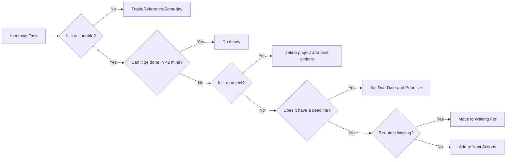

# Wednesday - April 10th 2024

```mermaid
graph LR
    A[Incoming Task] --> B{Is it actionable?}
    B -->|No| C[Trash/Reference/Someday]
    B -->|Yes| D{Can it be done in <2 mins?}
    D -->|Yes| E[Do it now]
    D -->|No| F{Is it a project?}
    F -->|Yes| G[Define project and next actions]
    F -->|No| H{Does it have a deadline?}
    H -->|Yes| I[Set Due Date and Prioritize]
    H -->|No| J{Requires Waiting?}
    J -->|Yes| K[Move to Waiting For]
    J -->|No| L[Add to Next Actions]
```
