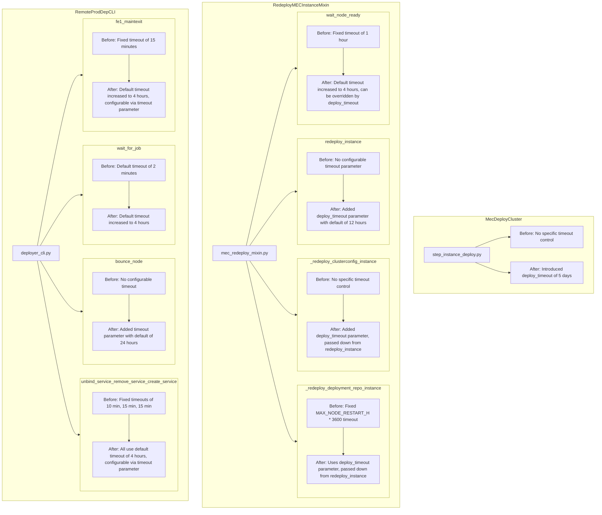

# Wednesday - July 17th 2024

that it covers all the use cases. I know for sure it doesn't like for some applications for some others maybe. Well mainly as a multi-tenant application I think that will be the biggest like can you like can JPB like serve up the tool to meet the needs of a multi-tenant application because most applications he's doing now are not. They're like you know a single application that needs to have its image like updated bumped but like this will be different. But okay multi-tenant why multi-tenant is different it's also using one. Well it's different in the sense that like yeah it's different in the sense that instead of making a change like we need the flexibility to be able to make a change for one like for an ad hoc or for like let's say a deployment we need to be able to change multiple and that needs to be smooth. Like not something that's an afterthought I think. Yeah and you know it's yeah it's tricky like with his deployer yeah because like it's also this what if we do this massive deployment like I don't know 100 clusters yeah hundreds of clusters like and you need and it's it depends like will you need multiple pull requests. Well then it's also like well you could but I think we have the means of controlling like how many are done at once. Yeah anyway okay let's see like you can talk to him like and maybe record it so we can see what was said. I'll take to him or sorry I'll talk to him and I won't be I'll just basically prepare us for the next conversation that we'll have and you're not making any like promises or anything I just want to let him know yeah okay.

---

