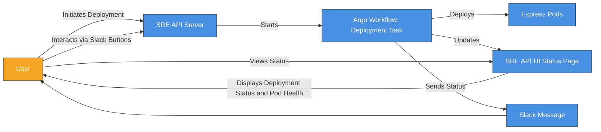
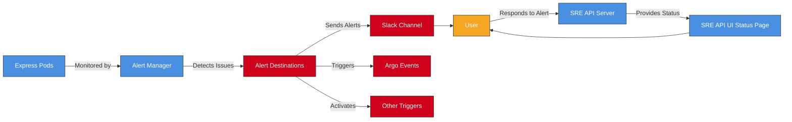
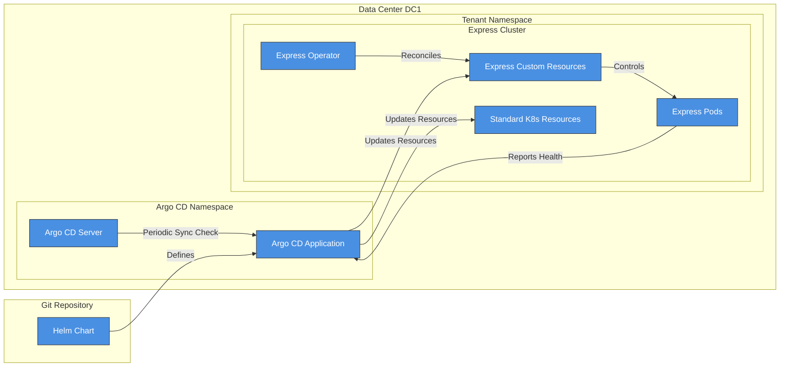

# Thursday - October 3rd 2024

Certainly! Let's split the monitoring diagram into two separate diagrams to represent the two different flows, ensuring both have the user as an entry/exit point and that the flows look similar. We'll update the descriptions to explain the differences between the two diagrams as they relate to deployment, using the context you've provided.

---

## **Diagram 2A: Deployment Workflow and User Interaction**

This diagram illustrates the deployment process initiated by the user through the **SRE API**, the monitoring of the deployment via the **Argo Workflow**, and direct feedback provided to the user through **Slack** and the **SRE API UI**.

**Components Explained**:

- **User**:
    - Initiates the deployment via the SRE API.
    - Receives status updates through Slack messages.
    - Interacts with the SRE API via Slack or directly through the UI.
    - Views detailed deployment status and pod health on the SRE API UI.
- **SRE API Server**:
    - Receives deployment requests from the user.
    - Initiates the Argo Workflow for deployment.
    - Communicates with the user via Slack and the SRE API UI.
- **Argo Workflow**:
    - Executes the deployment task.
    - Monitors the health and status of the deployment.
    - Sends status updates to the SRE API UI and directly to the user via Slack.
- **Express Pods**:
    - The application instances being deployed and monitored.
    - Their health and status are critical to the deployment's success.
- **SRE API UI Status Page**:
    - Provides a visual representation of deployment steps and pod health.
    - Accessible by the user for detailed monitoring.
- **Slack Message**:
    - Direct communication channel to the user.
    - Provides status updates and interactive buttons for further actions.

---

## **Diagram 2B: Continuous Monitoring and Alerting**

This diagram focuses on the continuous monitoring of the deployment by the **Alert Manager** and how it alerts the user when unexpected issues occur, such as prolonged deployments or degraded pod health.

**Components Explained**:

- **Express Pods**:
    - The deployed application instances.
    - Continuously monitored for health and performance issues.
- **Alert Manager**:
    - Monitors the Express Pods and overall deployment status.
    - Detects unexpected issues such as prolonged cache rebuilds or degraded pod health.
- **Alert Destinations**:
    - Channels through which alerts are sent when issues are detected.
        - **Slack Channel**: Sends immediate notifications to the user or team.
        - **Argo Events**: Triggers automated workflows or remediation actions.
        - **Other Triggers**: Can be configured for additional alerting mechanisms.
- **User**:
    - Receives alerts about issues.
    - Can respond to alerts by interacting with the SRE API Server.
    - Uses the SRE API UI to get detailed information and take corrective actions.
- **SRE API Server**:
    - Provides the user with tools to investigate and address issues.
    - Interfaces with the SRE API UI to display real-time status.
- **SRE API UI Status Page**:
    - Displays detailed information about the deployment and pod health.
    - Helps the user diagnose and resolve issues.

---

## **Flow Comparison and Deployment Context**

**Diagram 2A** represents the **Deployment Workflow and User Interaction**:

- The **user** initiates a deployment via the SRE API.
- The **Argo Workflow** carries out the deployment and monitors its progress.
- The **user** receives real-time feedback through Slack and can check detailed status on the SRE API UI.
- This flow is proactive, with the user directly involved in initiating and monitoring the deployment.

**Use Case**:

- Deploying a new version of the Express application.
- The user wants immediate feedback on the deployment status.
- The workflow ensures the user is informed about the success or failure of the deployment task.

**Diagram 2B** represents the **Continuous Monitoring and Alerting**:

- The **Alert Manager** continuously monitors the deployed **Express Pods**.
- If an issue is detected (e.g., a cache rebuild taking too long or degraded pod health), alerts are sent to the **user**.
- The **user** can then investigate and take action via the SRE API Server and UI.
- This flow is reactive, designed to catch unexpected issues that occur after deployment.

**Use Case**:

- A specific tenant's cache rebuild is taking longer than expected, potentially affecting application performance.
- The health of the cluster becomes degraded due to issues like pod failures or resource constraints.
- The **Alert Manager** detects these issues and alerts the **user** so they can take corrective action.

---

## **Integration Of User Entry/Exit Points**

In both diagrams, the **user** serves as the entry and exit point:

- **Entry Point**:
    - In Diagram 2A, the user initiates the deployment.
    - In Diagram 2B, the user receives alerts about issues.
- **Exit Point**:
    - In both diagrams, the user interacts with the system (via Slack or SRE API UI) to monitor status or respond to alerts.
    - The user concludes the flow by either confirming the deployment's success or addressing the alerted issues.

The similarity in the flows emphasizes the central role of the user in both proactive deployment management and reactive issue resolution.

---

## **Contextual Understanding**

Using the context provided about the **Express Health Monitoring**, these diagrams align with the need for monitoring both during and after deployments:

- **During Deployment**:
    - The **Argo Workflow** monitors the deployment progress, including the startup and readiness of the Express Pods.
    - It checks for various states (e.g., initializing, booting, synchronizing) to ensure a successful deployment.
    - The user is kept informed about these states to understand if the deployment is proceeding as expected.
- **After Deployment**:
    - The **Alert Manager** continuously monitors the health of the Express application.
    - It looks for signs of degradation, such as prolonged cache rebuilds or pods entering error states.
    - Alerts are sent if the application deviates from the healthy state, prompting user intervention.

---

## **Summary**

By splitting the monitoring diagram into two separate diagrams, we highlight the distinct flows:

1. **Deployment Workflow and User Interaction (Diagram 2A)**:

    - Focuses on the user's interaction with the deployment process.
    - Emphasizes proactive monitoring and direct feedback during deployment.

2. **Continuous Monitoring and Alerting (Diagram 2B)**:
    - Centers on the system's ongoing health monitoring after deployment.
    - Highlights reactive alerts to the user when unexpected issues arise.

Both diagrams together provide a comprehensive view of how deployment and monitoring processes involve the user, ensuring they are informed and can take action as needed to maintain the health of the Express application.

If you have any further adjustments or need additional details, please let me know!

# Next

Absolutely, that makes perfect sense! Consistency in style and layout across all diagrams enhances readability and helps convey the information more effectively. Let's update **Diagram 1** to match the style of the previous diagrams, incorporating colored containers to separate different parts of the process, thus making the diagram larger and clearer.

---

## **Updated Diagram 1: Git Repository & Argo CD Flow**

This diagram illustrates how the **Helm Chart** from the Git Repository defines the Argo CD Application, which then updates Kubernetes resources in the cluster. The use of colored containers separates different components, making the diagram more visually expansive and easier to understand.

**Components Explained**:

- **Git Repository**:
    - **Helm Chart**: Defines the desired state of the Express application using Kubernetes manifests and templates.
- **Data Center DC1**:
    - **Argo CD Namespace**:
        - **Argo CD Server**: Manages continuous delivery and deployment of applications.
        - **Argo CD Application**: Represents a deployment configuration of the Express application, as defined by the Helm Chart.
    - **Tenant Namespace**:
        - **Express Cluster**:
            - **Express Operator**: Custom controller that manages the lifecycle of Express Custom Resources.
            - **Express Custom Resources**: Define the desired state for the Express Pods.
            - **Express Pods**: The running instances of the Express application.
            - **Standard K8s Resources**: Additional Kubernetes resources required for the application (e.g., Services, ConfigMaps).

**Flow Explanation**:

1. **Helm Chart Definition**:

    - The **Helm Chart** in the **Git Repository** defines the configuration and desired state of the Express application.

2. **Argo CD Synchronization**:

    - The **Argo CD Server** performs periodic sync checks with the **Argo CD Application** to ensure the desired state is maintained.
    - The **Argo CD Application** uses the Helm Chart to know what needs to be deployed.

3. **Deployment to Kubernetes**:

    - The **Argo CD Application** updates the **Express Custom Resources** and **Standard K8s Resources** in the **Tenant Namespace**.
    - The **Express Operator** watches for changes in **Express Custom Resources** and reconciles the state by managing **Express Pods** accordingly.

4. **Health Reporting**:
    - The **Express Pods** report their health status back to the **Argo CD Application**, allowing Argo CD to display the overall health of the application.

---

## **Color Scheme and Containers**

- **Yellow Containers**: We've added yellow containers (`fill:#FFEB3B`) around major components (Git Repository, Argo CD Namespace, Tenant Namespace, Express Cluster) to separate different parts of the process visually. This matches the style from the previous diagrams and helps spread out the diagram, making it larger and clearer.
- **Color Coding**:
    - **Components** (`classDef component`): Blue boxes (`fill:#4A90E2`) represent key components like servers, applications, operators, and pods.
    - **Processes** (`classDef process`): Orange boxes (`fill:#F5A623`) could be used for processes if needed (not specifically used in this diagram but available for consistency).
    - **Data Centers** (`classDef dataCenter`): Green boxes (`fill:#7ED321`) denote data center boundaries or significant infrastructure divisions.

## **Consistent Styling Across Diagrams**

By applying the same color scheme and structural styling across all diagrams, we achieve visual consistency, making it easier for readers to understand and compare different parts of your system architecture. The use of colored containers helps to:

- **Visually Group Related Components**: By enclosing related elements within colored subgraphs, readers can quickly identify which components belong together.
- **Expand the Diagram Layout**: Spreading out components within these containers allows the diagram to occupy more space, making it less cramped and easier to read.
- **Emphasize Hierarchical Relationships**: The nested subgraphs (e.g., Tenant Namespace within Data Center DC1) reflect the hierarchical organization of your infrastructure.

## **Final Thoughts**

I believe updating Diagram 1 in this way meets your requirements and enhances the overall clarity and consistency of your documentation. The diagrams now:

- Use a consistent color scheme.
- Include yellow containers to separate different parts of the process.
- Are spread out to make them larger and more readable.

This approach should make it easier for anyone reviewing your diagrams to understand the architecture and workflows without confusion.

If there's anything else you'd like to adjust or if you have further questions, please let me know!
