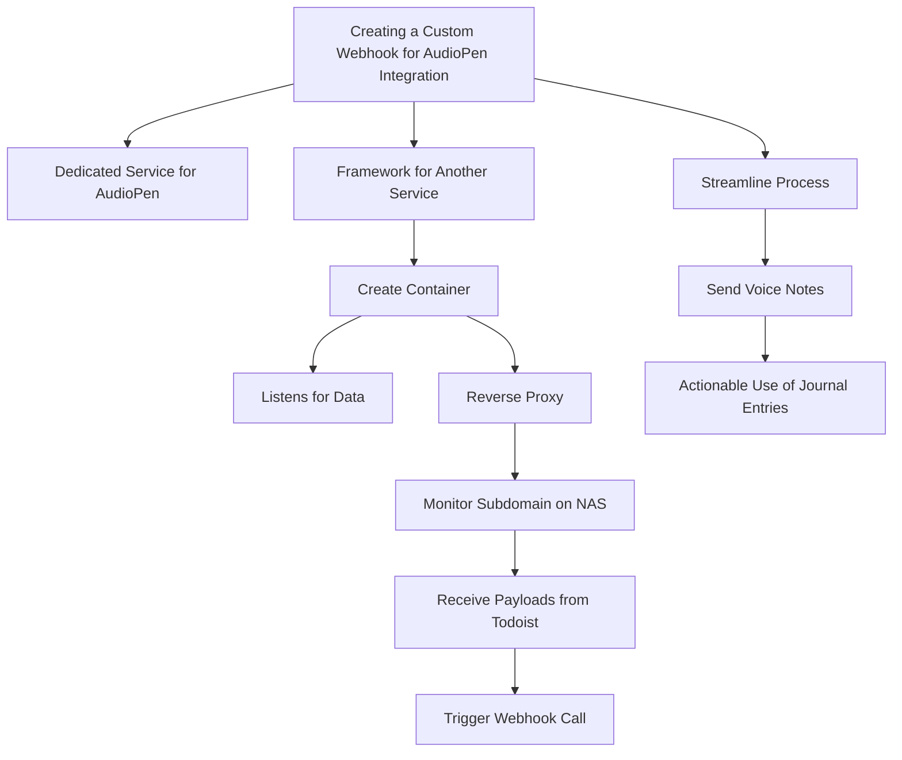

# Creating a Custom Webhook for AudioPen Integration

I don't know. For this particular task, I think there should be a dedicated service for audio PIN. I'm aware there's a service for Obsidian, but since I already have a framework for a different service, it makes sense to have one more service. I have a good framework in place, so I just need to create a container similar to the to-do container. This new container will listen for data and use a reverse proxy to monitor a specific subdomain on my NAS. This subdomain will be tailored to receive payloads every time I complete a task on Todoist. It's similar to audio PIN, but in this case, I control when I send voice data by triggering a webhook call to a specific URL.

I believe this approach will streamline the process of sending all my voice notes to a place where they can be of actionable use. By "actionable," I mean that the content of my audio notes, mostly journal entries, can be forwarded to a system where they can be acted upon. It's rewarding to know that these journal entries can be utilized effectively.

