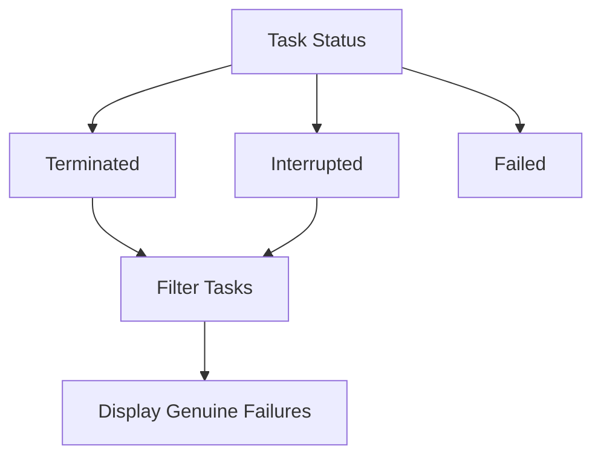

# Distinguishing Termination From Failure in SRE API Tasks

If a task is terminated or interrupted, we can use this state to filter and only display tasks that have genuinely failed.

---

- [ ] Create a jira for Kamil for this
