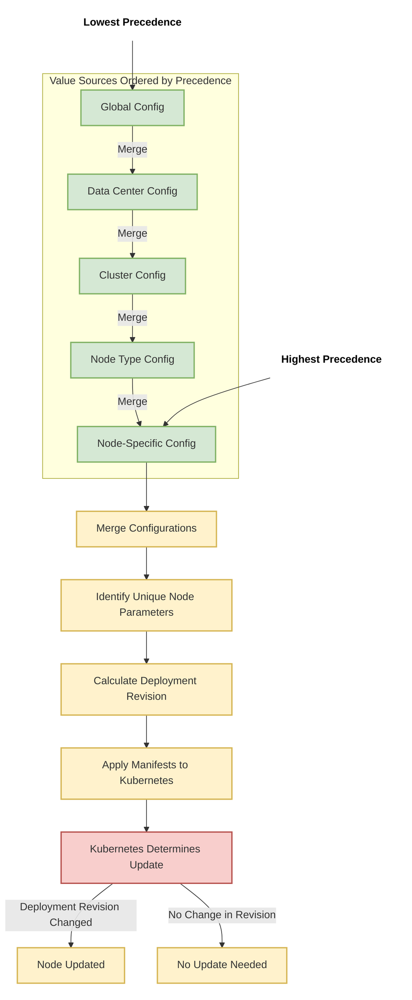

# Memo memos/751
- 15:55 #daily-record ^1729112110
```
Is there a way to display the debug parameters more effectively? For instance, we can see all the parameters for a specific node, but I'm interested in not just the changed parameter values, but also their exact locations. Regarding the order of precedence, if a parameter is set at the cluster configuration, I want to see it there. If it's not set at the cluster level but is set at the node type configuration, I would like that to be reflected at that level of precedence. Technically, you could have a value listed multiple times in a values.yaml file, but its actual significance depends on where it falls in the order of precedence. 
So, can you modify the debug output to make it more informative? This way, I can easily see when something changes from the node type to the cluster or from the node to the cluster configuration based on the order of precedence.
…
current debug output:
# deploymentRevision: bad175e5-systemdcrtest3-be
# derived:
#   copyCachesFrom: fe1
#   expressImage: virtual-docker.martifactory.io/medallia/express:express-e689.164
#   isFirstFrontend: false
# nodeType: Backend
# parameters:
#   additionalTenants: []
#   applicationName: express
#   atlasSvcCommonConfigVersion: master
#   configChangeset: a8d487b7be927ff2066e90d87130b4ae5612516c
#   containerMemoryDivisor: 10
#   containerMemoryHeadroomGiB: 10
#   containerMemoryMiB: 50176
#   containerMemoryMultiplier: 13
#   cpu: 2
#   disableDependencies: false
#   dockerRegistry: virtual-docker.martifactory.io
#   ephemeralDiskGiB: 40
#   expressImageRepository: medallia/express
#   expressVersion: express-e689.164
#   externalDomain: medallia.ca
#   failureThresholdMinutes: 60
#   feedDirNFSServer: 10.239.12.14
#   fullServiceName: be.be.express
#   guardEnabled: false
#   heapMemoryGiB: 30
#   ingressIpRange: 10.239.42.0/24
#   internalDomain: yul1.medallia.ca
#   ipAddress: 10.229.7.32
#   isTlsEnabled: false
#   listenPort: 9100
#   merciAtlasConfigHosts: config-service.config-service
#   nodeName: be
#   nodeType: Backend
#   order: 3
#   provisioning: false
#   serviceName: be
#   sharedStorage:
#     feedFileStore:
#       path: /feedfs_01
#     workdir:
#       path: /sharedworkdir/systemdcrtest3
#   subnets: []
#   tlsSecretNameExternal: wc-medallia-ca
#   tlsSecretNameExternalApi: wc-api-medallia-ca
#   tlsSecretNameInternal: wc-yul1-medallia-ca
#   up: true
#   upgradePrerequisiteNode: fe2
#   utilsImage: medallia/express-utils:1.1.1
#   workDirNFSServer: 10.239.12.14
….
contextual documenation:
#### 4.2. Node Configuration and Update Flow

**Key Steps:**
1. Merge configurations from various sources
2. Generate node parameters and data
3. Calculate deployment revisions
4. Compare revisions and determine updates
```